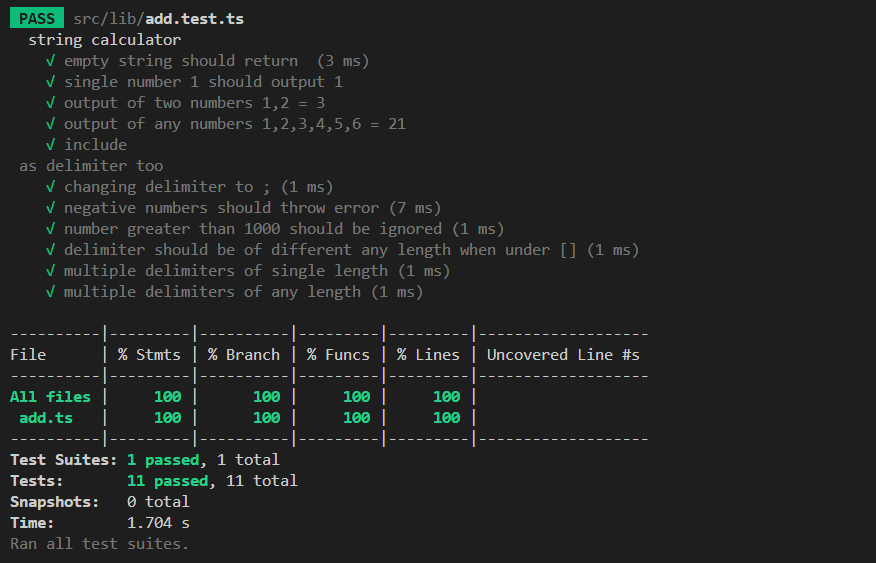

# Incubyte TDD Assessment - String Calculator

**Technical Skills Demonstrated:** Test-Driven Development

## Project Summary

Implemented a simple string calculator as part of Incubyte’s technical assessment using Test-Driven Development (TDD). This is full version of TDD Kaka - 1 from Roy Osherove. Developed incrementally by following the cycle: `test`, `add`, and `refactor`. The main logic resides in a function within the `src/lib` folder, which performs operations based on the input string. Each feature was added through this cycle, with a focus on writing clean and testable code.

## Function Template

```typescript
export default function add(numbers: string): number {}
```

## Key Points

- **Test-Driven Development**: Applied Red-Green-Refactor cycle for all test cases
- **Code Quality**: Maintained clean, readable, and maintainable TypeScript code
- **Framework**: Next.js

## Test Cases Covered

1. **Empty String Handling**

   - Input: `""` → Output: `0`

2. **Single Number Processing**

   - Input: `"1"` → Output: `1`

3. **Two Number Addition**

   - Input: `"1,2"` → Output: `3`

4. **Multiple Number Addition**

   - Input: `"1,2,3,4,5,6"` → Output: `21`

5. **Newline Delimiter Support**

   - Input: `"1\n2,3"` → Output: `6`

6. **Custom Delimiter Processing**

   - Input: `"//;\n1;2"` → Output: `3`

7. **Negative Number Validation**

   - Input: `"-1,3,-2"` → Throws: `"negatives not allowed -1,-2"`

8. **Large Number Filtering**

   - Input: `"1002,2"` → Output: `2`

9. **Multi-Character Delimiter Support**

   - Input: `"//[***]\n1***2***3"` → Output: `6`

10. **Multiple Single-Character Delimiters**

    - Input: `"//[*][%]\n1*2%3"` → Output: `6`

11. **Multiple Multi-Character Delimiters**
    - Input: `"//[**][%]\n1**2%3"` → Output: `6`

## Screenshot



## Installation and Execution

```bash
# Clone repository
git clone [repository-url]

# Install dependencies
npm install

# Run all test suites
npm run test

# Execute with coverage
npm run test:coverage
```

## Project Structure

```
src/
├── lib/
│   ├── add.ts      # Core calculator logic (45 lines)
│   └── add.test.ts # Comprehensive test suite (11 tests)
└── README.md       # Project documentation
```

## Development Methodology

**Test-Driven Development Process:**

1. **Red Phase**: Write failing test for new requirement
2. **Green Phase**: Implement minimal code to pass test
3. **Refactor Phase**: Optimize code while maintaining test coverage

## References

- Robert Martin(Uncle Bob) for 3 principles of TDD
- Next.js testing documentation for configuration of jest
- Jest's official documentation for working with jest library
